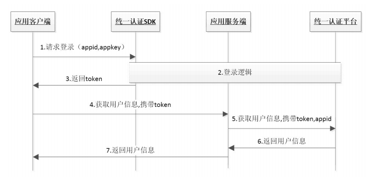

# 1. 开发环境配置

**注：SDK在首次获取token过程中，用户手机必须在打开数据网络情况下才能成功，纯wifi环境下只能使用短信验证码登录**


## 1.1. 环境配置

1. 将 quick_login_android_**.jar 拷贝到应用工程的libs目录下，如没有该目录，可新建;
2. 将sdk所需要的证书文件 serverPublicKey.pem 拷贝到项目 assets 目录下。

**[1] AndroidManifest.xml设置**

添加必要的权限支持: 

```
   <uses‐permission android:name="android.permission.INTERNET" />
   <uses‐permission android:name="android.permission.READ_PHONE_STATE" />
   <uses‐permission android:name="android.permission.ACCESS_WIFI_STATE" />
   <uses‐permission android:name="android.permission.ACCESS_NETWORK_STATE" />
   <uses‐permission android:name="android.permission.CHANGE_NETWORK_STATE" />
```
2. 配置授权登录activity
若需要配置短信校验获取token，开发者可自行编写activity进行短验获取token，具体配置操作请参考demo中示例配置;

通过以上两个步骤，工程就已经配置完成了。接下来就可以在代码里使用统一认证的SDK进行开发了


## 1.2. Hello 统一认证 

本节内容主要面向新接入统一认证的开发者，介绍快速集成统一认证的基本服务的方法。

### 1.2.1. 统一认证登录流程




由流程图可知，业务客户端集成SDK后只需要完成2步集成实现登录

    1.	调用登录接口获取token
    2.	携带token请求登录

### 1.2.2. 统一认证登录集成步骤
**[2] 创建一个AuthnHelper实例**

`AuthnHelper`是SDK的功能入口，所有的接口调用都得通过AuthnHelper进行调用。因此，调用SDK，首先需要创建一个AuthnHelper实例

**方法原型：**

```
public static AuthnHelper getInstance(Context context)
```
**示例代码：**

```
public void onCreate(Bundle savedInstanceState) {
    super.onCreate(savedInstanceState);
    mContext = this;    
    ……
    mAuthnHelper = AuthnHelper.getInstance(mContext);
    }
```

**【3】AuthnHelper初始化**

AuthnHelper 是SDK的功能入口，实例化后需要初始化功能参数：
```
    //设置是否输出sdk日志
    mAuthnHelper.setDebugMode(true);
    //设置sdkAppid和sdkAppkey
    mAuthnHelper.init(Constant.APP_ID, Constant.APP_KEY);
    //设置超时时间，默认8s，时间单位毫秒
    mAuthnHelper.setTimeOut(12000);
```

**[4] 实现回调**

所有的SDK接口调用，都会传入一个回调，用于接收SDK返回的调用结果。结果以`JsonObject`的形式传递，`TokenListener`的实现示例代码如下：

```
mListener = new TokenListener() {
    @Override
    public void onGetTokenComplete(JSONObject jObj) {
        if (jObj != null) {
            mResultString = jObj.toString();
            mHandler.sendEmptyMessage(RESULT);
            if (jObj.has("token")) {
                mtoken = jObj.optString("token");
            }
        }
    }
};

```

**[5] 混淆策略**

请避免混淆一键登录SDK，在Proguard混淆文件中增加以下配置：

```
-dontwarn com.cmic.cmccssolibrary.**
-keep class com.cmic.cmccssolibrary.**{*;}
```

### 1.3. 如何使用单点登录

业务A在使用单点登录到业务B时，需要先使用隐式登录/短信验证码登录获取token，再将token传递到业务B，由业务B带着token去换取业务A使用者的用户手机号码，完成单点登录流程。


## 2.  SDK方法说明

## 2.1. 预取号

## 2.1.1 方法描述
使用SDK登录前，可以通过预取号方法提前获取用户信息并缓存。用户使用一键登录时，会优先使用缓存的信息快
速请求SDK服务端获取 token 和 用户ID(openID) 等信息，提高登录速度。缓存的有效时间是5min并且只能使用一
次。
注意：预取号前，开发者需提前申请 READ_PHONE_STATE 权限，否则预取号会失败！

原型

```
public void umcLoginPre(int umcLoginPreTimeOut, TokenListener listener)
```

## 2.1.2 参数说明

| 参数               | 类型             |说明         |
| ------------------ | --------- |--------------------|
| umcLoginPreTimeOut | int      |预取号超时时间        |
| listener           | TokenListener      |TokenListener为回调监听器，是一个java接口，需要调用者自己实现；TokenListener是接口中的认证登录token回调接口，OnGetTokenComplete是该接口中唯一的抽象方法，即void OnGetTokenComplete(JSONObject  jsonobj)|

响应参数

OnGetTokenComplete的参数JSONObject，含义如下：

| 字段               | 类型      |含义         |
| ------------------ | --------- |--------------------|
| resultCode | int      |接口返回码，“103000”为成功。具体返回码见 SDK返回码|
| resultDesc | string      |返回码对应的中文描述|
| securityphone | string      |电话号码掩码|
| openId | string      |手机号码对应的唯一标识 |
| loginMethod | string      |登录的方法 |
| operatortype | string      |运营商类型：0 未知；1 移动；2 联通；3 电信 |
| usetimes      | string   |预取号使用的时间，单位毫秒           |

## 2.1.3 请求示例代码

```
    mAuthnHelper.umcLoginPre(5000, mListener);
```

响应示例

```
    {
    "resultCode": "103000",
    "resultDesc": "预取号成功",
    "securityphone": "188****4562",
    "openId": "BcLpJvyl1GZSQffq1AHSslObqmlfNs6_XALVMNsdvozll3XufPo4",
    "loginMethod": "umcLoginPre",
    "operatortype": "1",
    "usetimes": "177ms",
    }
```

## 2.2 隐式登录

## 2.2.1 方法描述

本方法目前只能用于token校验功能。开发者通过隐式登录方法，无授权弹窗，可获取到token和
openID，应用服务端凭token向SDK服务端请求校验。
注：隐式登录返回的token用宇校验用户信息。
注意：隐式登录前，开发者需提前申请 READ_PHONE_STATE 权限，否则会失败！
说明：目前AndroidQ无法获取sim卡信息，所以在AndroidQ我们无法判断用户是否换卡，用户换卡我们也无法清楚缓存。

原型

```
    public void getTokenImp(String authType, TokenListener listener);
```

## 2.2.2 参数说明

请求参数

| 参数        | 类型             |说明         |
| ------------| ---------------- |--------------------|
| authType    | String              |认证类型        |
| listener    | TokenListener    |TokenListener为回调监听器，是一个java接口，需要调用者自己实现；TokenListener是接口中的认证登录token回调接口，OnGetTokenComplete是该接口中唯一的抽象方法，即void OnGetTokenComplete(JSONObject  jsonobj)  |

响应参数

OnGetTokenComplete的参数JSONObject，含义如下：

| 字段       | 类型      |含义         |
| -----------| ---------|--------------------|
| resultCode | int       |接口返回码，“103000”为成功。具体返回码见 SDK返回码|
| authType  | Int   |登录类型 |
| authTypeDes  | String   |登录类型中文描述 |
| selectSim  | String   |手机sim卡槽标识 |
| securityphone  | String   |电话号码掩码 |
| openId  | String   |用户身份唯一标识 |
| token  | String   |成功返回:临时凭证，token有效期2min，一次有效，同一用户（手机号）10分钟内获取token且未使用的数量不超过30个 |

## 2.2.3 示例

请求示例代码

```
    mAuthnHelper.getTokenImp(AuthnHelper.AUTH_TYPE_WAP, mListener);
```

响应示例代码

```
    {
    "resultCode": "103000",
    "authType": "2",
    "authTypeDes": "网关鉴权",
    "selectSim":"1",
    "securityphone": "188****4562",
    "openId": "003JI1Jg1rmApSg6yG0ydUgLWZ4Bnx0rb4wtWLtyDRc0WAWoAUmE",
    "token": "STsid0000001512438403572hQSEygBwiYc9fIw0vExdI4X3GMkI5UVw",
    }
```
## 2.3 获取短信验证码

## 2.3.1 方法描述

SDK提供短信验证码作为网关取号的补充功能，获取token。目前短信验证码只支持移动和电信手机号码 无网络时，不提供短验服务 未获取READ_PHONE_STATE授权时，不提供短验服务

原型

```
    public void sendSMS(String phoneNum, TokenListener listener);
```

## 2.3.2 参数说明

请求参数

| 参数        | 类型             |说明         |
| ------------| ---------------- |--------------------|
| phoneNum    | String              |手机号码        |
| listener    | TokenListener    |TokenListener为回调监听器，是一个java接口，需要调用者自己实现；TokenListener是接口中的认证登录token回调接口，OnGetTokenComplete是该接口中唯一的抽象方法，即void OnGetTokenComplete(JSONObject  jsonobj)  |

响应参数

OnGetTokenComplete的参数JSONObject，含义如下：

| 字段       | 类型      |含义         |
| -----------| ---------|--------------------|
| resultCode | String       |接口返回码，“103000”为成功。具体返回码见 SDK返回码|
| resultDesc | String   |返回结果描述 |

## 2.2.3 示例

请求示例代码

```
    mAuthnHelper.sendSMS("13416112345", mListener);
```

响应示例代码

```
    {
    "resultCode": "103000",
    "resultDesc": "success"    
    }
```
## 2.4 短信验证码登录（可选）

## 2.4.1 方法描述

该方法用于短信验证码登录，用户应先调用获取短信验证码接口，等待手机接收到短信验证码，然后再调用此方法将短信验证码和手机号码作为参数传进来，即可完成短信验证码的登录。

原型

```
    public void getTokenSms(String phoneNum, String authCode, TokenListener listener);
```

## 2.4.2 参数说明

请求参数

| 参数        | 类型             |说明         |
| ------------| ---------------- |--------------------|
| phoneNum    | String              |手机号码        |
| authCode    | String              |验证码        |
| listener    | TokenListener    |TokenListener为回调监听器，是一个java接口，需要调用者自己实现；TokenListener是接口中的认证登录token回调接口，OnGetTokenComplete是该接口中唯一的抽象方法，即void OnGetTokenComplete(JSONObject  jsonobj)  |

响应参数

OnGetTokenComplete的参数JSONObject，含义如下：

| 字段       | 类型      |含义         |
| -----------| ---------|--------------------|
| resultCode | String       |接口返回码，“103000”为成功。具体返回码见 SDK返回码|
| authType  | String   |登录类型 |
| authTypeDes  | String   |登录类型中文描述 |
| selectSim  | String   |手机sim卡槽标识 |
| openId  | String   |用户身份唯一标识 |
| token  | String   |成功返回:临时凭证，token有效期2min，一次有效，同一用户（手机号）10分钟内获取token且未使用的数量不超过30个 |

## 2.4.3 示例

请求示例代码

```
    mAuthnHelper.sendSMS("13416112345","1234" mListener);
```

响应示例代码

```
    {
    "resultCode": "103000",
    "authType": "7",
    "authTypeDes": "短信验证码",
    "selectSim":"1",
    "openId": "TddPLEIu1bG5jaPLfc1IxuOqDnZJa7dXhAnIcUOG_sqymDFoBowA",
    "token": "STsid0000001512438403572hQSEygBwiYc9fIw0vExdI4X3GMkI5UVw"
    }
```


## 2.5 设置取号超时

## 2.5.1 方法描述

设置取号超时时间，默认为8秒，应用在预取号、隐式登录阶段时，如果需要更改超时时间，可使用该
方法配置。

原型

```
    public void setTimeOut(int timeOut)
```
## 2.5.2 参数说明

请求参数

| 参数        | 类型             |说明         |
| ------------| ---------------- |--------------------|
| timeOut    | int              |设置超时时间（单位：毫秒）|

响应参数

无
## 2.5.3 示例

请求示例代码

```
    mAuthnHelper.setTimeOut(12000);
```
响应示例代码

无

## 2.6 清除中间件缓存信息

## 2.6.1 方法描述

该方法用于清除中间件缓存信息，当用户不想使用中间件信息进行登录的时候，可以使用该方法将中间件信息清除，然后再进行登录操作。中间件清除后，用户再次登录时，将走网关/短信逻辑重新取号。

```
    public void clearChache()
```
## 2.6.2 参数说明

请求参数

无

响应参数

无
## 2.6.3 示例

请求示例代码

```
    mAuthnHelper.clearChache();
```
响应示例代码

无

## 2.7 获取SDK版本号

## 2.7.1 方法描述

供接入方区分SDK的版本号，便于反馈SDK的相关信息。

```
    public void getCoreSdkVersion()
```
## 2.7.2 参数说明

请求参数

无

响应参数

| 字段               | 类型      |含义         |
| ------------------ | --------- |--------------------|
| sdkVersion | String      |SDK的版本号 |

## 2.7.3 示例

请求示例代码

```
    String sdkVersion = mAuthnHelper.getCoreSdkVersion();
```
响应示例代码

无


## 3 平台接口说明

## 3.1 获取用户信息接口

业务平台或服务端携带用户授权成功后的token来调用统一认证服务端获取用户手机号码等信息。注：本接口仅适
用于5.3.0及以上版本SDK

## 3.1.1 业务流程

SDK在获取token过程中，用户手机必须在打开数据网络情况下才能获取成功，纯wifi环境下不支持取号，返回错误码，或者使用SDK的短
信验证码功能获取token（如果有配置）


## 3.1.2 接口说明

请求地址：https://token.cmpassport.com:8300/uniapi/uniTokenValidate

协议： HTTPS

请求方法： POST+json,Content-type设置为application/json

回调地址：请参考开发者接入流程文档

## 3.1.3 参数说明

请求参数

| 参数    |约束 |层级  |参数类型   |说明          |
| --------| ----|------|---------|---------------|
| header |必选 |1 |   |     |
| version |必选 |2 |string |填1.0     |
| msgid |必选 |2 |string |标识请求的随机数即可(1-36位)    |
| systemtime |必选 |2 |string |请求消息发送的系统时间，精确到毫秒，共17位，格式：20121227180001165 |
| id |必选 |2 |string |业务或应用集成统一认证的标识，需提前申请：sourceId或appId（八位）。临时凭证校验时，id必须为sourceid（六位） |
| idtype |必选 |2 |string |id类型：0：sourceid 1:appid。临时凭证校验时，idtype必须为0 |
| apptype |必选 |2 |string |参见“渠道编码定义”1 BOSS 2 web 3 wap 4 pc客户端 5 手机客户端 |
| userip |可选 |2 |string |客户端用户来源ip  |
| message |可选 |2 |string |接入方预留参数（不定），该参数会透传给通知接口，此参数需urlencode编码 |
| expandparams |可选 |2 |string |业务扩展参数（不定），多个参数以 竖线 分隔，每个参数长度为3字节 sdk签发的token和临时凭证校验成功后返uid |
| sign |必选 |2 |string |签名，MD5(apptype  +id+idtype+key+msgid+ systemtime+token+version)，输出32位小写字母+数字,其中，key为appkey或sourcekey,由idtype确定。id为sourceid且sourcekey不存在的情况，key为空，建议通过认证平台申请sourcekey以提高安全性。（注：“+”号为合并意思，不包含在被加密的字符串中,appkey为秘钥, 参数名做自然排序（Java是用TreeMap进行的自然排序））可参考附录D的示例代码Sign.java |
| body |必选 |1 | |  |
| token |必选 |2 |string |需要解析的凭证值（320左右）  |
| userInformation |可选 |2 |string |加密的浏览器指纹，智能认证jssdk token校验时必填，其他token校验时不填 （非sdk字段） |


响应参数

| 参数    |约束 |层级  |参数类型   |说明          |
| --------| ----|------|---------|---------------|
| header |必选 |1 |   |     |
| version |必选 |2 |string |1.0有升级时调整 |
| inresponseto |必选 |2 |string |对应的请求消息中的msgid |
| systemtime |必选 |2 |string |响应消息发送的系统时间，精确到毫秒，共17位，格式：20121227180001165  |
| resultcode |必选 |2 |string |返回码，返回码对应说明见附录A |
| resultdesc |可选 |2 |string |返回结果描述信息 |
| body |必选 |1 | |  |
| usessionid |可选 |2 |string| 基于uid的token校验成功后，该字段为uid |
| openid |可选 |2 |string |用户对外身份标识  |
| msisdnmask |可选 |2 |string |手机号码掩码，如：138****1234 |
| passid |必选 |2 |string |用户统一账号的系统标识（校验融合sdk token时，为可选）  |
| msisdn |可选 |2 |string |手机号码经过AES加密后的结果,密钥为appkey或sourceKey经md5转换后的值。如果appkey或sourceKey不存在，则返回明文，建议通过认证平台申请sourceKey以提高安全性。可使用参考附录E中的deCodeAES()进行解密 |
| email |可选 |2 |string |表示邮箱地址 |
| loginid |必选 |2 |string |咪咕token校验时必选。用户登录时，输入的用户名，可以有三种类型：0：手机号码 1：邮箱 2：普通用户名（字母数字组合）3：第三方账号唯一标识，QQ/微信为unoinid，其他为openid|
| loginidtype |可选 |2 |string |登录使用的用户标识：0：手机号码1：邮箱2：普通用户名（字母数字组合）3: 第三方账号（QQ/微信/支付宝/新浪微博）|
| msisdntype |可选 |2 |string |手机号码的归属运营商：0：中国移动 1：中国电信2：中国联通99：未知的异网手机号码 |
| province |可选 |2 |string |用户所属省份(暂无)  |
| authtype |可选 |2 |string |认证方式,具体取值参考附录C  |
| authtime |可选 |2 |string |统一认证平台认证用户的时间 |
| relateToAndPassport |可选 |2 |string |是否已经关联到统一账号，暂无用处 |
| relateToMiguPassport |可选 |2 |string |用户在本业务平台的账号是否已经关联到咪咕账号，若已关联，与咪咕账号中手机/邮箱相同的业务账号不能再登录。咪咕token校验时必选0：已经关联1：未关联 |
| implicit |可选 |2 |string |是否为隐式咪咕账号，咪咕token校验时必选0：不是1：是 |
| fromid |可选 |2 |string |来源sourceid或appid类型0：sourceid 1:appid |
| fromidtype |可选 |2 |string |来源sourceid或appid类型0：sourceid 1:appid |
| toid |可选 |2 |string |目标sourceid或appid（即签发token的sourceid或appid） |
| fromidtype |可选 |2 |string |来源sourceid或appid类型0：sourceid 1:appid |
| toid |可选 |2 |string |目标sourceid或appid（即签发token的sourceid或appid） |
| toidtype |可选 |2 |string |目标sourceid或appid类型0：sourceid 1:appid |
| message |可选 |2 |string |接入方预留参数，此参数需urlencode编码 |
| userid |可选 |2 |string |临时凭证校验响应字段，用户内部标识 |
| nickname |可选 |2 |string |昵称 |
|lastchangetime |可选 |2 |string |临时凭证校验响应字段，通行证信息最后一次更新时间，精确到毫秒，共17位，格式：20121227180001165 |
| exresparams |可选 |2 |string |响应扩展参数，多个参数以 竖线 分隔，顺序与请求扩展参数对应 |


## 3.1.4 示例

请求示例

```
   {
	"header": {
		"version": "1.0",
		"msgid": "1533635625757",
		"systemtime": "20180807175345757",
		"id": "012005",
		"idtype": "0",
		"apptype": "3",
		"sign": "dc090d3c24959d42b56691ba424dfb65"
	},
	"body": {
		"token": "8484010001320200344E6A5A4551554D784F444E474E446C434E446779517A673340687474703A2F2F3139322E3136382E31322E3233363A393039302F0300040353EA68040006313030303030FF00203A020A143C6703D7D0530953C760744C7D61F5F7B546F12BC17D65254878748C"
	}
}

```

备注：示例中的token不会过期，可重复使用，可以用于验证调用流程。正式的token只能使用一次。但使用示例中的token时，无法通过传递扩展参数获取uid。

响应示例代码

```
    {
    "header": {
		"inresponseto": "1533635625757",
		"resultcode": "103000",
		"systemtime": "20180807175344658",
		"version": "1.0",
		"resultdesc": "成功(103000)"
	},
	"body": {
		"msisdntype": "0",
		"toid": "012005",
		"passid": "000000000",
		"fromid": "100000",
		"lastactivetime": "",
		"authtype": "WAPGW",
		"toidtype": "0",
		"fromidtype": "0",
		"usessionid": "NjZEQUMxODNGNDlCNDgyQzg3@http://192.168.12.236:9090/@06",
		"msisdnmask": "188****0000",
		"loginidtype": "0",
		"authtime": "2018-08-07 17:53:44",
		"msisdn": "nvBSIzynspuOFuLZYX4nJQ==",
		"relateToAndPassport": "1"
	}

    }
```
## 4 返回码说明

## 4.1 SDK返回码

使用SDK时，SDK会在认证结束后将结果回调给开发者，其中结果为JSONObject对象，其中resultCode为结果响应码，103000代表成功，其他为失败。成功时在根据toke字段取出身份标识。失败时根据resultCode定位失败原因。

| 返回码 | 返回码描述                                                   |
| ------ | ------------------------------------------------------------ |
| 103000 | 成功             |
| 102101 | 无网络            |
| 102102 | 网络异常          |
| 102103 | 未开启数据网络    |
| 102121 | 用户取消登录     |
| 102223 | 数据解析异常     |
| 102203 | 输入参数错误     |
| 102507 | 请求超时，预取号、buffer页取号、登录时请求超时   |
| 200002 | 手机未安装sim卡   |
| 200005 | 用户未授权（READ_PHONE_STATE）   |
| 200010 | 取号请求时获取imsi失败    |
| 200014 | 手机号格式错误     |
| 200015 | 短信验证码格式错误     |
| 200016 | 更新KS失败     |
| 200021 | 数据解析异常                                                 |
| 200022 | 无网络状态                                                   |
| 200023 | 请求超时                                                     |
| 200024 | 数据网络切换失败                                             |
| 200025 | 未知错误一般出现在线程捕获异常，请配合异常打印分析           |
| 200026 | 输入参数错误                                                 |
| 200027 | 未开启数据网络                                               |
| 200028 | 网络请求出错       |
| 200031 | 生成token失败       |
| 200033 | 复用中间件获取Token失败        |
| 200035 | 协商ks失败        |
| 200036 | 预取号失败        |
| 200037 | 获取不到openid        |
| 200038 | 电信重定向失败         |
| 200039 | 电信取号接口返回失败      |
| 200043 | 获取不到btid      |
| 200050 | EOF异常      |
| 200072 | CA认证失败      |
| 200082 | 不支持的认证方式      |
| 200083 | 检测到hook风险      |


## 4.2 获取手机号码接口返回码

| 返回码 | 返回码描述               |
| ------ | ------------------------ |
| 103000 | 返回成功                 |
| 103101 | 签名错误                 |
| 103113 | token内容错误            |
| 103119 | appid不存在              |
| 103133 | sourceid不合法           |
| 103211 | 其他错误                 |
| 103412 | 无效的请求               |
| 103414 | 参数校验异常             |
| 103811 | token为空                |
| 104201 | token失效或不存在        |
| 105018 | 用户权限不足             |
| 105019 | 应用未授权（开发者社区） |


## 4.3 本机号码校验接口返回码

| 返回码 | 说明                       |
| ------ | -------------------------- |
| 000    | 是本机号码（纳入计费次数） |
| 001    | 非本机号码（纳入计费次数） |
| 002    | 取号失败                   |
| 003    | 调用内部token校验接口失败  |
| 004    | 加密手机号码错误           |
| 102    | 参数无效                   |
| 124    | 白名单校验失败             |
| 302    | sign校验失败               |
| 303    | 参数解析错误               |
| 606    | 验证Token失败              |
| 999    | 系统异常                   |
| 102315 | 次数已用完                 |


## 5 Q&A

## 5.1  SDK使用网络问题？

a.在数据流量环境下，SDK可以正常从数据网关取号；

b.在wifi+数据流量环境下，SDK会调用方法强制将当前的wifi通道切换到数据流量通道，再通过数据网关正常取号（此过程大概会消耗用户1-2KB流量）；

c.在纯wifi环境下，SDK无法取号，可以使用短信验证码进行校验。

## 5.2 SDK支持三网运营商么？

    一键登录SDK支持三网，但是由于联通接口问题，目前IOS版SDK无法获取联通用户的手机号码；
    
 ## 5.3 OPPO终端网络问题
    
 a. 由于oppo操作系统增加了应用的数据网络使用权限，在手机wifi和数据网络同时打开时，应用首次打开，将默认使用wifi数据通道，且无法通过SDK强制切换到数据通道取号，会导致取号失败；
 
 b. 用户必须在纯数据网络环境打开应用，用户授权应用使用数据网络权限后，SDK切换功能才能使用。
    
## 5.4 关于Android 5.0操作系统切换数据通道问题

Android 5.x操作系统普遍存在wifi切数据网络通道延时问题，导致取号超时


<div STYLE="page-break-after: always;"></div>
